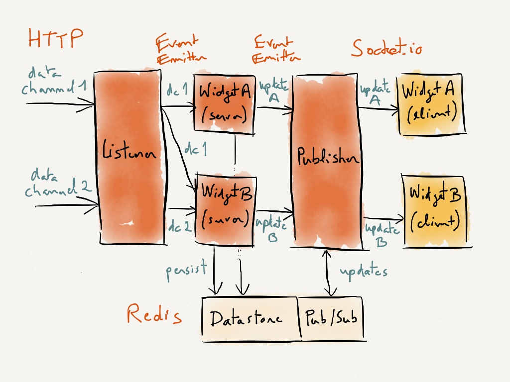

# Motherboard

A simple real-time dashboard for internal metrics.

- [Demo](#demo)
- [Install](#install)
- [Usage](#usage)
- [Architecture overview](#architecture-overview)
- [Development](#development)
- [Room for improvement](#room-for-improvement)

## Demo

You can see a running demo with a few example widgets at: [http://motherboard.herokuapp.com/](http://motherboard.herokuapp.com/)

## Install

Requirements:

- [Node.js](http://nodejs.org/) >= 0.8
- [Redis](http://redis.io/) >= 2.4
- [npm](https://npmjs.org/) and [Bower](http://twitter.github.com/bower/)

Clone this repository, then install the dependencies:

```bash
$ npm install
$ bower install
```

## Quickstart

You can immediately run the app with the included demo widgets. 

First start a local Redis server:

```bash
$ redis-server
```

Then set the `DEMO` environment variable and start the app:

```
$ export DEMO=true
$ node server
```

Point your browser to `http://localhost:3000` to see the dashboard.

Read on for more info on how to customize the widgets!

## Usage

### Adding widgets

Widgets are found in `widgets/` for the server-side, and `public/js/widgets/` for the client-side. To add a widget, you need to do so in both directories.

For the server-side part, create a file `widgets/my_widget.js` containing:

```javascript
var NumberWidget = require('../lib/number_widget');

var widget = new NumberWidget('my_widget', {
  channels: ['some_data_channel']
});

module.exports = widget;
```

There are different types of widgets (only `NumberWidget` is currently implemented), but they all have a **name**, `'my_widget'`, and listen to one or more **data channels**, `'some_data_channel'` in our example. A **data channel** corresponds to incomming data updates, usually from other systems and applications. More on that later.

For the dashboard app to load the server-side portion of your widget, make sure you add it to the `widgets` collection by adding a line in `widgets/index.js`:

```javascript
widgets.add(require('./my_widget'));
```

Next we need to create the corresponding client-side portion of the widget. For that, create a file `public/js/widgets/my_widget.js` containing:

```javascript
define([
  'app',
  'lib/number_widget'
],

function(app, NumberWidget) {

  var widget = new NumberWidget.Model({
    name: 'my_widget',
    title: 'My Widget'
  });

  return widget;

});
```

The only thing to watch out for here is that the "client-side widget" and the "server-side widget" need to have the same **name**.

As we did for the server-side, we need to add our widget to the client-side `widgets` collection in `public/js/widgets/index.js`:

```javascript
define([
  'app',
  'lib/widgets',
  // Widgets
  'widgets/my_widget'
],

function(app, Widgets, myWidget) {

  var widgets = new Widgets.Collection();

  // Add the widgets you want here
  widgets.add(myWidget);

  return widgets;

});
```

Start the server (make sure you have Redis running), and you should see the widget appear! Now we need to get data to it.

### Data channels

As mentioned above, a **data channel** designates a particular set of "data events" coming from other systems.

For example, your user registration application could send a "registered users + 1" event every time a user signs up, on a `'registered_users'` data channel. It could also send a "premium users + 1" event every time a user upgrades to a premium account, on a `'premium_users'` data channel. We can have two widgets, listening to each data channel, showing the total number of registered users and the total number of premium users. We could also imagine a widget that shows the *percentage of premium users among registered users*, and that widget would need to listen to both `'registered_users'` and `'premium_users'` data channels.

So how do we get data through these data channels to our widgets? The current implementation is through **HTTP POST** (but we could imagine adding other transports, like a message queue).

In our `'my_widget'` example, we are listening to the `'some_data_channel'` channel, so we can send data with:

```bash
$ curl -i -X POST -H 'Content-Type: application/json' \
-d '{"delta": 1}' \
http://localhost:3000/channels/some_data_channel
```

The `NumberWidget` can react to these different JSON "data events":

```json
{
    "delta": 1
}
```

(Increments the value by 1. You can also use negative deltas.)

```json
{
    "value": 900
}
```

(Resets the value to 900.)

```json
{
    "value": 900,
    "timestamp": "2013-03-21T14:41:45-04:00"
}
```

(Resets the value and its timestamp. Timestamps are in **ISO 8601** format, and can also be used with the `"delta"` data event.)

### Producers

As we saw above, you can send data updates to the dashboard app directly from other applications and systems.

But, if for instance you can't or don't want to do that, the dashboard app also provides a way to create simple "producers", which are just background workers that periodically check for data updates from some data source, and send them over to the dashboard app through the HTTP API. For example, you could have a producer that periodically makes a call to the Twitter API to get tweets with a particular mention or hashtag.

To add a producer, create a file `producers/my_producer.js` that follows this structure:

```javascript
var Producer = require('../lib/producer');

var producer = new Producer('my_producer', {

  // In milliseconds, default 1000
  updateInterval: 1000,

  getInitial: function(callback) {
    // Change this to fetch some initial data from source
    var data = {
        value: 700,
        timestamp: '2013-03-19T19:02:38-04:00'
    };
    callback(null, data);
  },

  getUpdate: function(callback) {
    // Change this to check the source for any data update
    var data = {delta: 1};
    callback(null, data);
  }

});

module.exports = producer;
```

Note that fetching data is more often than not an asynchronous operation, so you define functions that pass the data back to a `callback`.

Like the widgets, you need to add the producer to the `producers` collection in `producers/index.js`:

```javascript
producers.add(require('./my_producer'));
```

Now you can run the `worker.js` file which starts the producers (make sure that your dashboard app server and Redis are running):

```bash
$ node worker
# Or if you want to see what the producer is doing
$ DEBUG=motherboard:* node worker
```

By default, producers expect the dashboard app to be running on `localhost:3000`, and will post data events to that `/channels` HTTP endpoint. If you are running it on a different host/port (for example when deployed), specify the full endpoint with the environment variable:

```bash
$ export PRODUCER_HTTPENDPOINT='http://some-host:3001/channels'
```

**NOTE**: In the demo, we ran the producers in the same thread as the app with `DEMO=true node server`, but in practice you will want to run them in the separate background worker like shown above.

## Deployment

The dashboard app is ready for deployment to [Heroku](http://get.heroku.com/), but can easily be adapted to any other deployment environment.

### Heroku

Create the app (replace `my-motherboard` with the name you want):

```bash
$ heroku create my-motherboard
```

Provision the Redis datastore from [Redis To Go](https://addons.heroku.com/redistogo):

```bash
$ heroku addons:add redistogo
```

(The `REDISTOGO_URL` environment variable is automatically created for the app to use.)

Set the `/channels` HTTP endpoint for **producers** (see section on producers above):

```bash
$ heroku config:set PRODUCER_HTTPENDPOINT='http://my-motherboard.herokuapp.com/channels'
```

Set the app environment to production, and optionally set more verbose output for the logs:

```bash
$ heroku config:set NODE_ENV=production
$ heroku config:set DEBUG=motherboard:*
```

Push the app:

```bash
$ git push heroku master
```

## Architecture overview

The dashboard app is broken down into internal components each responsible for different things. If we follow the way data flows through the app, these components are:

- [Listener](lib/listener.js): Captures external **data events** (ex: "user registered") on different **data channels**, and passes them on to the appropriate widgets.
- [Widget (Server)](lib/widget.js): Takes **data events** from one or more **data channels**, processes them to update a particular **metric** (ex: "number of registered users"), and persists the metric to a datastore.
- [Publisher](lib/publisher.js): Listens for **widget updates** and takes care of publishing them to **client** widgets (web browser), as well as possible other instances of the app.
- [Widget (Client)](public/js/lib/widget.js): Updates the UI as changes to the widget's **metric** are published by the server-side of the app.

The app also provides a [Producer](lib/producer.js) component that you can optionally use to create **data events**.



## Development

### Debug

The app uses the [debug](https://github.com/visionmedia/debug) module to log things to the console. You can see more verbose output by setting the `DEBUG` environment variable before running the app:

```bash
$ DEBUG=motherboard:* node server
```

### Build

[Grunt](http://gruntjs.com/) is used to assemble [RequireJS](http://requirejs.org/) client-side modules, concatenate and minify JavaScript and CSS files, and compile [Handlebars](http://handlebarsjs.com/) templates.

During development run:

```bash
$ grunt watch
```

And before deployment, build the concatenated and minified files with:

```bash
$ grunt build
```

### Test

The [Mocha](http://visionmedia.github.com/mocha/) framework with the [Chai](http://chaijs.com/) assertion library are used for testing.

To run the server-side tests use:

```bash
$ make test
```

## Room for improvement

This is a very basic version of a dashboard app, and there is a lot of room for improvements. Some of these are:

- More widget types: a Number & Trend Widget (ex: "Registered Users 1,023 up 20% from 7 days ago"), a Leaderboard Widget (ex: "Top Most Active Users"), etc.
- Authentication
- Better code sharing between the client-side and server-side, possibly to make it so you only need to create one file to add a widget
- More tests
- Other data channel transport options (RabbitMQ?)
